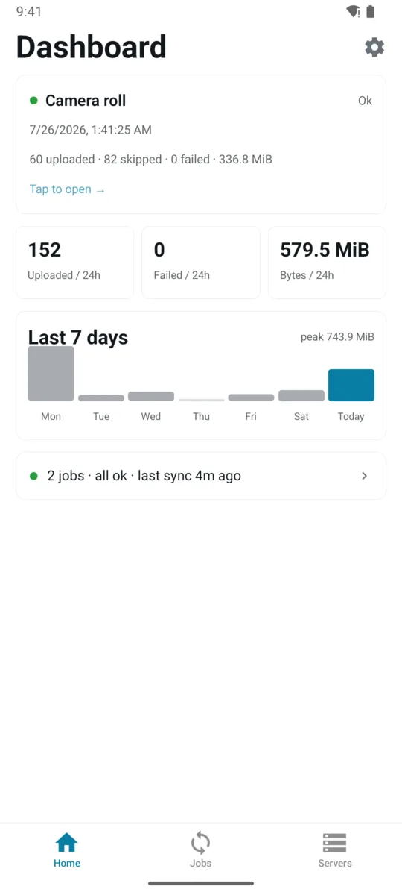
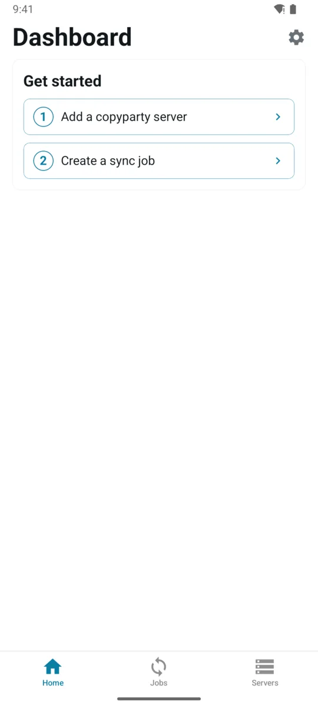
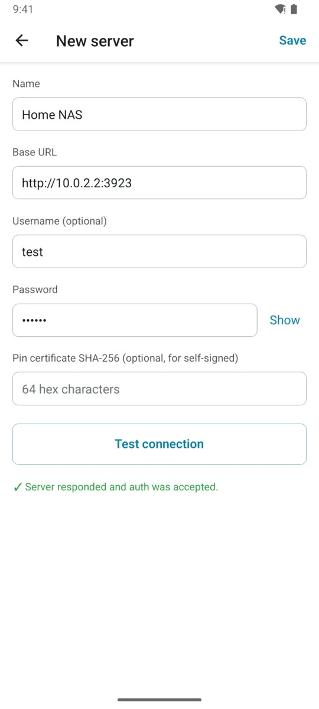
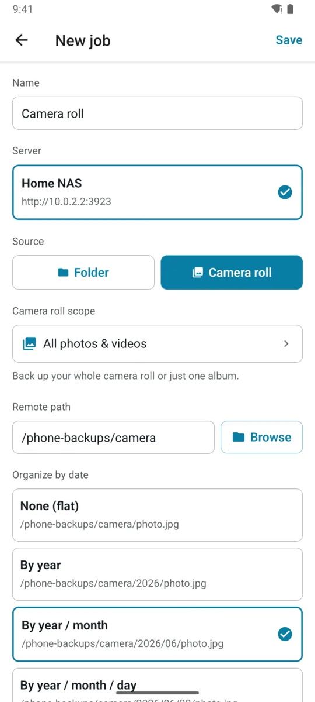
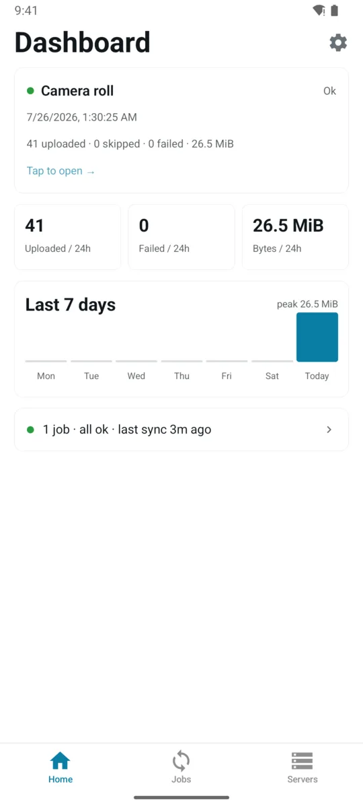
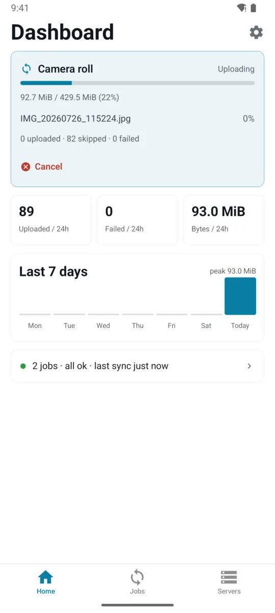
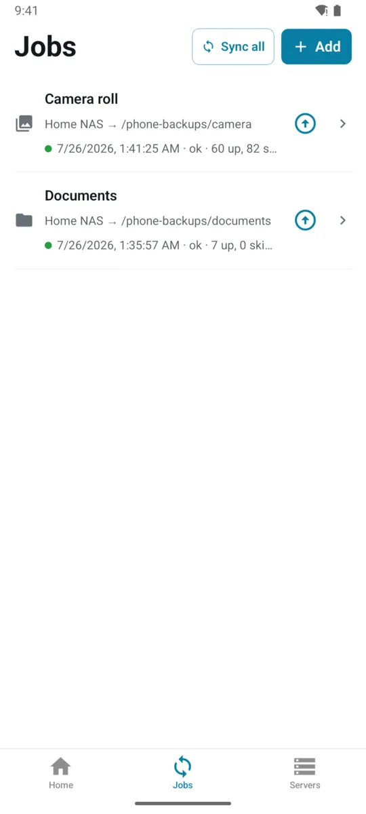
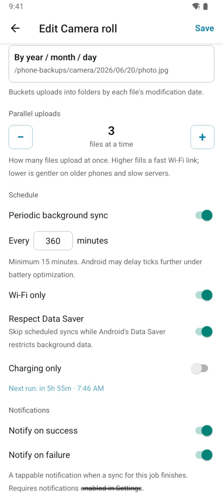
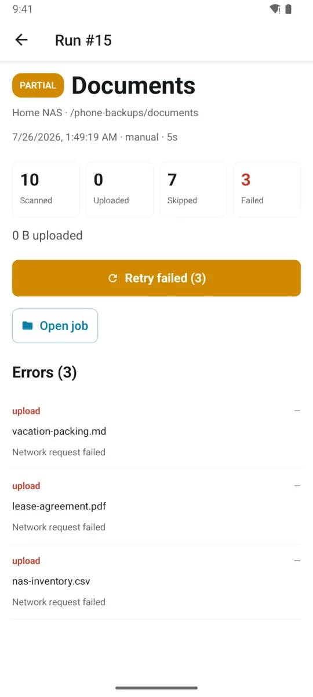
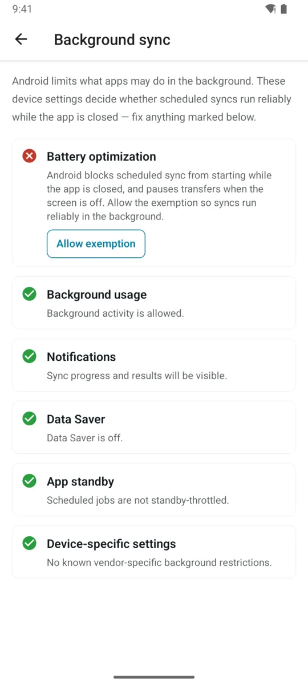

# copyparty client for Android

Back up your phone to your own server. This app syncs folders and your camera roll
from Android to a [copyparty](https://github.com/9001/copyparty) server — on your
LAN or anywhere else. No cloud, no Google services.

[](https://github.com/jonnyczi/copyparty-client/releases/latest)
[](LICENSE)

<p align="center">
  <picture>
    <source media="(prefers-color-scheme: dark)" srcset="docs/screenshots/dashboard-dark.webp">
    
  </picture>
</p>

## Features

- **Folder & camera-roll sync jobs** — back up any folder or your photo library; each job has its own server, remote path, and album scope
- **Scheduled background sync** — periodic sync every N minutes with Wi-Fi-only, Data-Saver, and charging-only constraints; a foreground service keeps long uploads alive
- **Setup health checklist** — probes battery optimization, background limits, Data Saver, and vendor quirks, with one-tap fixes so scheduled syncs actually run
- **Fast, deduplicated uploads** — copyparty's up2k protocol with content hashing; files the server already has are skipped without re-uploading
- **Run history & retry** — every sync records per-file results and errors; retry just the failed files with one tap
- **Date-organized uploads** — bucket photos into `2026/07/`-style folders by modification date
- **Notifications without Google** — per-job success/failure notifications built on plain AndroidX, no Firebase/GMS
- **Backup & restore** — export servers and jobs to an optionally encrypted file and import them on another device
- **Plain `http://` and self-signed TLS** — LAN servers without certificates work out of the box; pin a certificate SHA-256 for self-signed HTTPS

## Permissions

The app asks for the minimum Android needs to do the job, and nothing is sent anywhere
except the server you configure.

| Permission | Why |
| --- | --- |
| Photos & videos (`READ_MEDIA_IMAGES`, `READ_MEDIA_VIDEO`) | Read the camera roll so it can be backed up. Folder-only jobs don't need it. |
| Photo location (`ACCESS_MEDIA_LOCATION`) | Upload photos **exactly as they are**. Android strips the GPS tag out of any photo an app reads without this, so your backup would silently differ from the original — see below. |
| Notifications (`POST_NOTIFICATIONS`) | Sync result alerts and the upload progress notification. Local only; no Firebase or Google services. |
| Foreground service, wake lock, battery-optimization exemption | Keep long uploads and scheduled background syncs alive. |
| Network state | Honour the Wi-Fi-only and Data-Saver constraints. |

### Why a location permission

This one reads alarmingly on the permission list, so: it does not let the app find out
where you are. It stops Android from **editing your photos on the way out**. When an app
reads a photo without `ACCESS_MEDIA_LOCATION`, Android blanks the GPS block inside the
JPEG first. The file is the same length, so nothing looks wrong — but the bytes differ
from the file on your device, which means the photo loses its location and your server
can't tell it's the same photo it already has, so it stores a second copy.

Declining is fine and the app keeps working. You'll see a notice on the job explaining
that photos are being backed up without their location.

**Upgrading from v0.6.0 or earlier:** photos backed up before this permission existed
were stored without their location, and if a copy was already on the server they were
saved under a `name-<timestamp>-<random>` filename. Photos backed up from now on are
correct. To re-upload the older ones intact, delete and recreate the camera-roll job —
anything already correct on the server is deduplicated rather than re-sent, so it costs
hashing time, not bandwidth.

## Install

Download the APK from the [latest release](https://github.com/jonnyczi/copyparty-client/releases/latest),
verify it against the release's `SHA256SUMS`, and sideload it.

F-Droid and Google Play submissions are planned — see [docs/roadmap.md](docs/roadmap.md).

## Quick start

You need a copyparty server reachable from your phone —
[setting one up](https://github.com/9001/copyparty#quickstart) takes a minute.

**1. Open the app** — the dashboard walks you through the two setup steps.

<picture>
  <source media="(prefers-color-scheme: dark)" srcset="docs/screenshots/quickstart-1-get-started-dark.webp">
  
</picture>

**2. Add your server** — base URL plus optional username and password.
**Test connection** confirms the URL and credentials before you save.

<picture>
  <source media="(prefers-color-scheme: dark)" srcset="docs/screenshots/quickstart-2-add-server-dark.webp">
  
</picture>

**3. Create a sync job** — pick a local folder or your camera roll, choose the
remote path (browse the server's folders in-app), and optionally organize uploads
into date folders.

<picture>
  <source media="(prefers-color-scheme: dark)" srcset="docs/screenshots/quickstart-3-create-job-dark.webp">
  
</picture>

**4. Sync** — tap **Sync now** (or let the schedule handle it). The dashboard
tracks results, volume, and errors.

<picture>
  <source media="(prefers-color-scheme: dark)" srcset="docs/screenshots/quickstart-4-first-sync-dark.webp">
  
</picture>

## A quick tour

### Live progress

Active syncs show throughput, ETA, and per-file progress — on the dashboard and
as a foreground-service notification. Cancel any time.

<picture>
  <source media="(prefers-color-scheme: dark)" srcset="docs/screenshots/sync-active-dark.webp">
  
</picture>

### All your jobs in one place

Each job shows its target and last result. Sync one job, or everything with
**Sync all**.

<picture>
  <source media="(prefers-color-scheme: dark)" srcset="docs/screenshots/jobs-dark.webp">
  
</picture>

### Scheduling that respects your battery and data

Per-job periodic sync with Wi-Fi-only, Data-Saver, and charging-only constraints,
parallel-upload tuning, and per-job notifications.

<picture>
  <source media="(prefers-color-scheme: dark)" srcset="docs/screenshots/schedule-dark.webp">
  
</picture>

### Run history with per-file errors — and one-tap retry

Every sync records what was scanned, uploaded, skipped, and failed. Failed files
list the exact error and can be retried on their own.

<picture>
  <source media="(prefers-color-scheme: dark)" srcset="docs/screenshots/run-retry-dark.webp">
  
</picture>

### Background sync that actually runs

Android loves to kill background work. The built-in checklist probes battery
optimization, background limits, Data Saver, and vendor-specific settings — and
fixes each one with a tap.

<picture>
  <source media="(prefers-color-scheme: dark)" srcset="docs/screenshots/background-sync-dark.webp">
  
</picture>

## Development

Expo / React Native app with native Android modules — Expo Go won't work, you need
a dev build. The repo ships a Nix dev shell with the full Android toolchain and a
Dockerized copyparty for local testing:

```bash
nix develop
npm run android                 # build + install on a connected emulator/device
npm run test:integration:up     # local copyparty on :3923
```

`npm test` runs the unit tests, `npm run lint` lints. Full setup details
(emulator, NixOS notes, test server): [docs/development.md](docs/development.md).

## Building & releases

Release APKs/AABs are built reproducibly in a container via Dagger — only Docker
is needed on the host:

```bash
dagger call build-apk export --path ./out/app.apk
```

See [docs/release-pipeline.md](docs/release-pipeline.md) for signing, CI, and the
F-Droid-friendly build gates. Versions are bumped with `npm run bump-version`;
tagging `vX.Y.Z` publishes a GitHub Release.

## License

[MIT](LICENSE)
